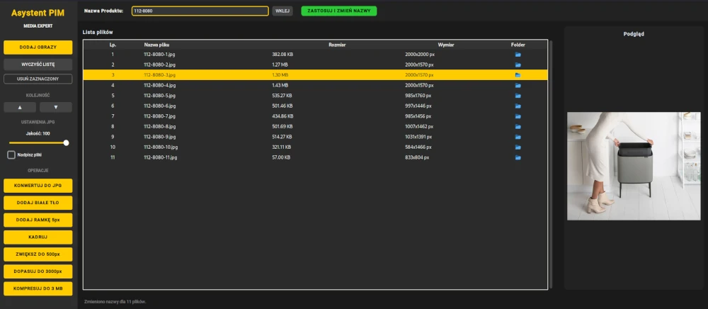

# Asystent PIM Media Expert (Linux Port)



Jest to port aplikacji "Asystent PIM Media Expert" pierwotnie napisanej w C# (.NET) na natywną aplikację Linux z nowoczesnym interfejsem graficznym.

## Funkcjonalność
Aplikacja służy do optymalizacji i przygotowywania obrazów zgodnie z wymaganiami Media Expert. Główne funkcje obejmują:
- Dodawanie obrazów (JPG, PNG, WEBP, AVIF, HEIC, TIFF, BMP).
- Zmiana kolejności plików na liście (przyciski ▲/▼).
- Podgląd obrazu.
- Otwieranie folderu pliku bezpośrednio z listy.
- Inteligentna zmiana nazw plików:
    - Zamiana polskich znaków na odpowiedniki łacińskie (np. 'ą' -> 'a').
    - Zamiana spacji i znaków specjalnych na myślniki (-).
    - Redukcja wielokrotnych myślników (np. `--` -> `-`).
    - Automatyczne numerowanie plików (np. `Produkt-MARKA-model-1.jpg`).
- Operacje na obrazach:
    - **KONWERTUJ DO JPG:** Konwersja zaznaczonych obrazów do formatu JPG z możliwością kontroli jakości (suwak 10-100%).
    - **DODAJ BIAŁE TŁO:** Dodaje białe tło do obrazów PNG, skalując płótno do minimum 500x500px, jeśli jest mniejsze.
    - **DODAJ RAMKĘ 5px:** Dodaje białą ramkę o szerokości 5px wokół obrazu.
    - **KADRUJ:** Inteligentne kadrowanie obrazu do wykrytego obiektu (usuwa jednolite, jasne tło).
    - **ZWIĘKSZ DO 500px:** Zwiększa mniejsze obrazy do minimum 500px w najkrótszym wymiarze (zachowując proporcje).
    - **DOPASUJ DO 3000px:** Zmniejsza większe obrazy, aby żaden wymiar nie przekraczał 3000px (zachowując proporcje).
    - **KOMPRESUJ DO 3 MB:** Inteligentny algorytm kompresji, który redukuje jakość, a w ostateczności wymiary, aby zmieścić plik w limicie 3 MB.
- Opcja **"Nadpisz pliki"**: Kontroluje, czy operacje modyfikują oryginalny plik, czy tworzą nową kopię (oryginał przenoszony do podfolderu `_orig`).
- Nowoczesny interfejs graficzny (CustomTkinter) w barwach Media Expert.

## Instalacja i Uruchomienie (dla programistów)

### Wymagania
- Python 3.8+
- `pip` (menedżer pakietów Pythona)

### Krok 1: Klonowanie repozytorium
```bash
git clone https://github.com/TWOJA_NAZWA_UZYTKOWNIKA/Asystent-PIM-Media-Expert-Linux.git
cd Asystent-PIM-Media-Expert-Linux
```

### Krok 2: Instalacja zależności
Zalecane jest użycie wirtualnego środowiska:
```bash
python3 -m venv venv
source venv/bin/activate
pip install -r LinuxPort/requirements.txt
```
Jeśli budujesz w środowisku `distrobox` na Arch Linux, możesz użyć:
```bash
distrobox-enter -n arch -- sudo pacman -S --noconfirm python-pip python-pillow python-avif-plugin python-heif-plugin tk
distrobox-enter -n arch -- python -m pip install -r LinuxPort/requirements.txt --break-system-packages
```
*(Uwaga: paczki AVIF/HEIF na Archu to `python-avif-plugin` i `python-heif-plugin` w AUR lub `pillow-avif-plugin` i `pillow-heif` przez `pip`)*

### Krok 3: Uruchomienie aplikacji
```bash
python LinuxPort/main.py
```

### Krok 4: Budowanie samodzielnego pliku wykonywalnego (binarnego)
Aby stworzyć jeden plik wykonywalny, który będzie działał bez instalacji Pythona (Linux ELF):
```bash
pip install pyinstaller # Jeśli nie jest zainstalowany
pyinstaller --noconfirm --onefile --windowed --name "AsystentMediaExpert" --collect-all customtkinter --hidden-import='PIL._tkinter_finder' LinuxPort/main.py
```
Gotowy plik znajdziesz w folderze `dist/`.

## Użycie
- Uruchom `AsystentMediaExpert` z folderu `dist/`.
- Dodaj zdjęcia, przeciągając je do okna lub klikając "DODAJ OBRAZY".
- Zaznacz pliki i korzystaj z funkcji.

## Licencja
Ten projekt jest objęty licencją MIT. Szczegóły znajdziesz w pliku `LICENSE`.

## Zastrzeżenie
**Niniejszy program jest niezależnym projektem i nie jest oficjalnym produktem ani nie jest w żaden sposób powiązany z firmą Media Expert.** Został stworzony wyłącznie w celach edukacyjnych i użytkowych.
