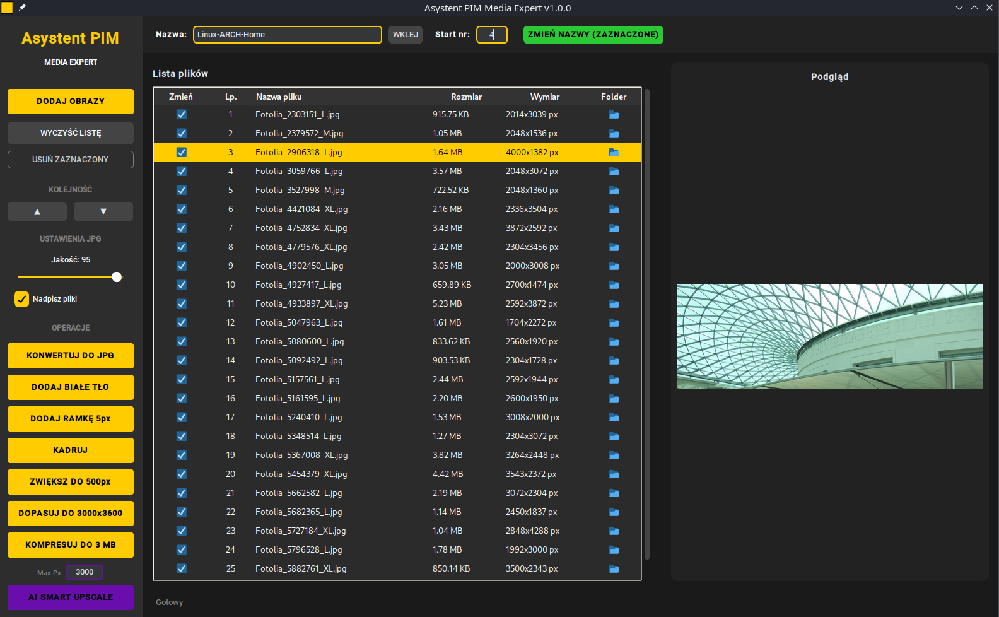

# asystentPIM v1.0.8



Jest to otwartoźródłowa **reimplementacja** aplikacji "asystentPIM", napisana od podstaw w języku Python dla systemu Linux, oferująca nowoczesny interfejs graficzny.

## Funkcjonalność
Aplikacja służy do optymalizacji i przygotowywania obrazów zgodnie z wymaganiami. Główne funkcje obejmują:
- Dodawanie obrazów (JPG, PNG, WEBP, AVIF, HEIC, TIFF, BMP).
- Zapamiętywanie ostatnio używanego katalogu do dodawania plików.
- Zmiana kolejności plików na liście (przyciski ▲/▼).
- Podgląd obrazu.
- Otwieranie folderu pliku bezpośrednio z listy.
- Inteligentna zmiana nazw plików:
    - Zamiana polskich znaków na odpowiedniki łacińskie (np. 'ą' -> 'a').
    - Zamiana spacji i znaków specjalnych na myślniki (-).
    - Redukcja wielokrotnych myślników (np. `--` -> `-`).
    - Automatyczne numerowanie plików (np. `Produkt-MARKA-model-1.jpg`).
- Operacje na obrazach:
    - **KONWERTUJ DO JPG:** Konwersja zaznaczonych obrazów do formatu JPG z możliwością kontroli jakości (suwak 10-100%).
    - **DODAJ BIAŁE TŁO:** Dodaje białe tło do obrazów PNG, skalując płótno do minimum 500x500px, jeśli jest mniejsze.
    - **DODAJ RAMKĘ 5px:** Dodaje białą ramkę o szerokości 5px wokół obrazu (dookoła).
    - **PASEK 5px L+P:** Dodaje biały pasek o szerokości 5px po lewej i prawej stronie obrazu.
    - **PASEK 5px G+D:** Dodaje biały pasek o szerokości 5px u góry i na dole obrazu.
    - **KADRUJ (AUTO):** Inteligentne kadrowanie obrazu do wykrytego obiektu (usuwa jednolite, jasne tło).
    - **KADRUJ (ZAZNACZENIE):** Otwiera edytor graficzny, w którym można ręcznie zaznaczyć obszar do wykadrowania.
    - **ZWIĘKSZ DO 500px:** Zwiększa mniejsze obrazy do minimum 500px w najkrótszym wymiarze (zachowując proporcje).
    - **DOPASUJ DO 3000px:** Zmniejsza większe obrazy, aby żaden wymiar nie przekraczał 3000px (zachowując proporcje).
    - **KOMPRESUJ DO 3 MB:** Inteligentny algorytm kompresji, który redukuje jakość, a w ostateczności wymiary, aby zmieścić plik w limicie 3 MB.
    - **Usuń tło (RMBG-2.0):** Wykorzystuje model AI do precyzyjnego usuwania tła z obrazów (dostępne przez menu "Experimental" lub menu kontekstowe).
    - **Inpainting (Usuń obiekt):** Wykorzystuje AI (lokalne Stable Diffusion lub fallback OpenCV) do usuwania obiektów ze zdjęć (dostępne przez menu "Experimental" lub menu kontekstowe).
    - **Sprawdź obraz (Inspekcja):** Wyświetla obraz z ekstremalnym kontrastem i niską jasnością, aby uwypuklić wady (dostępne przez menu kontekstowe).
- Opcje eksportu (dostępne w menu "Export"):
    - **EKSPORTUJ DO PDF (Zaznaczone):** Łączy zaznaczone obrazy w jeden wielostronicowy plik PDF.
    - **EKSPORTUJ DO JPG (Zaznaczone):** Konwertuje zaznaczone obrazy do formatu JPG, zapisując je w wybranym folderze.
- Opcja **"Nadpisz pliki"**: Kontroluje, czy operacje modyfikują oryginalny plik, czy tworzą nową kopię (oryginał przenoszony do podfolderu `_orig`).
- **Inteligentne usuwanie z dysku:** W menu kontekstowym opcja "❌ USUŃ Z DYSKU" pozwala na trwałe usunięcie pliku lub przeniesienie go do folderu `tmp`.
- Nowoczesny interfejs graficzny (CustomTkinter) w barwach Media Expert.

## Instalacja i Uruchomienie (dla programistów)

### Wymagania
- Python 3.8+
- `pip` (menedżer pakietów Pythona)
- **Ważne:** Dla lokalnego uruchamiania `rmbg_tool` (usuwanie tła) wymagane jest środowisko wirtualne z `torch`, `transformers` itd.

### Krok 1: Klonowanie repozytorium
```bash
git clone https://github.com/LucasTerg/Asystent-PIM-Media-Expert-Linux.git
cd Asystent-PIM-Media-Expert-Linux
```

### Krok 2: Instalacja zależności
Zalecane jest użycie wirtualnego środowiska. Dla pełnej funkcjonalności (w tym RMBG):
```bash
# Stwórz i aktywuj główne środowisko
python3 -m venv venv
source venv/bin/activate
pip install --upgrade pip
pip install -r requirements.txt
pip install tkinterdnd2 pyinstaller

# Stwórz i zainstaluj zależności dla narzędzia RMBG (local_rmbg.py)
python3 -m venv .venv_rmbg
.venv_rmbg/bin/pip install --upgrade pip
.venv_rmbg/bin/pip install torch torchvision transformers pillow huggingface_hub kornia timm
```
Jeśli budujesz w środowisku `distrobox` na Arch Linux, możesz użyć:
```bash
distrobox-enter -n arch -- sudo pacman -S --noconfirm python-pip python-pillow python-avif-plugin python-heif-plugin tk
# dla 7z: sudo pacman -S --noconfirm p7zip
distrobox-enter -n arch -- python -m pip install -r requirements.txt --break-system-packages
# dla rmbg_tool (utwórz venv i zainstaluj libki wewnątrz kontenera)
distrobox-enter -n arch -- python3 -m venv .venv_rmbg
distrobox-enter -n arch -- .venv_rmbg/bin/pip install --upgrade pip
distrobox-enter -n arch -- .venv_rmbg/bin/pip install torch torchvision transformers pillow huggingface_hub kornia timm pyinstaller
```

### Krok 3: Uruchomienie aplikacji
```bash
python main.py
```

### Krok 4: Budowanie samodzielnego pliku wykonywalnego (binarnego)
Aby stworzyć pliki wykonywalne (`asystentPIM` i `rmbg_tool`):
```bash
# Upewnij się, że .venv_rmbg jest stworzone i zainstalowane (jak w Kroku 2)
./buduj.sh
```
Gotowe pliki znajdziesz w folderze `dist/`.

### Konfiguracja 7-Zip (dla funkcji Eksport do 7z)
Aby funkcja eksportu do 7z działała, musisz mieć zainstalowany `7z` w systemie i dostępny w zmiennej środowiskowej `PATH`.
- **Linux:** Zazwyczaj `sudo apt install p7zip-full` lub `sudo pacman -S p7zip`.
- **macOS:**
    1. Zainstaluj Homebrew: `/bin/bash -c "$(curl -fsSL https://raw.githubusercontent.com/Homebrew/install/HEAD/install.sh)"`
    2. Zainstaluj 7z: `brew install p7zip`
    3. Alternatywnie, pobierz binarkę `7z` (np. z https://www.7-zip.org/download.html), utwórz folder `~/bin` i umieść tam plik `7zz` (zmień nazwę na `7z`). Następnie dodaj `~/bin` do swojej zmiennej `PATH`.

## Pobieranie i Uruchamianie Wersji Skompilowanych

Najnowsze skompilowane wersje aplikacji dla systemów **Linux**, **macOS Intel** oraz **macOS Apple Silicon (ARM64)** są dostępne w sekcji [Releases](https://github.com/LucasTerg/Asystent-PIM-Media-Expert-Linux/releases) tego repozytorium.

### Struktura folderu po rozpakowaniu
Po pobraniu i rozpakowaniu archiwum ZIP dla Twojego systemu, zobaczysz:
- `asystentPIM` (główny plik wykonywalny)
- `rmbg_tool/` (folder zawierający narzędzie do usuwania tła)
- Inne pliki i foldery potrzebne do działania.

### Uruchamianie na Linux
1.  Pobierz `asystentPIM-Linux.zip` z najnowszego wydania (Release).
2.  Pobierz **rmbg_tool-Linux.zip** z tego samego Release (lub z Google Drive, jeśli przekracza limit GitHub).
    *   **UWAGA: rmbg_tool-Linux.zip ma ponad 2GB i NIE jest hostowany na GitHubie.**
    *   **Pobierz rmbg_tool-Linux.zip (ok. 4.6GB) z Google Drive:** [rmbg_tool-Linux.zip (Google Drive)](https://drive.google.com/file/d/1Cr2Bo-TBi1-6sT8bywyPq7Sg0RJ83kIf/view?usp=sharing)
3.  Rozpakuj oba archiwa.
4.  Umieść folder `rmbg_tool` obok pliku `asystentPIM-Linux`.
5.  Nadaj plikom uprawnienia wykonywania:
    ```bash
    chmod +x asystentPIM-Linux
    chmod +x rmbg_tool/rmbg_tool
    ```
6.  Uruchom aplikację:
    ```bash
    ./asystentPIM-Linux
    ```

### Uruchamianie na macOS
1.  Pobierz odpowiedni plik ZIP (`asystentPIM-macOS-arm64.zip` lub `asystentPIM-macOS-Intel.zip`) z najnowszego wydania (Release).
2.  Pobierz również odpowiedni `rmbg_tool-macOS-arm64.zip` / `rmbg_tool-macOS-Intel.zip`
3.  Rozpakuj oba archiwa. Umieść folder `rmbg_tool` obok pliku wykonywalnego `asystentPIM-macOS-arm64` / `asystentPIM-macOS-Intel`.
4.  Nadaj plikom uprawnienia wykonywania:
    ```bash
    chmod +x asystentPIM-macOS-arm64 # lub Intel
    chmod +x rmbg_tool/rmbg_tool
    ```
5.  **Usuń atrybut kwarantanny** (wymagane przez macOS dla aplikacji spoza App Store):
    ```bash
    xattr -d com.apple.quarantine asystentPIM-macOS-arm64 # lub Intel
    ```
6.  Uruchom aplikację:
    *   **Z terminala:** `./asystentPIM-macOS-arm64`
    *   **Graficznie:** Dwukrotnie kliknij plik w Finderze.

## Użycie
- Uruchom `asystentPIM` z folderu `dist/` lub pobrany plik bezpośrednio.
- Dodaj zdjęcia, przeciągając je do okna lub klikając "DODAJ OBRAZY" (lub "Plik" -> "Dodaj folder").
- Zaznacz pliki i korzystaj z funkcji.
- Dostęp do opcji widoczności elementów interfejsu (np. ukrywania sekcji) znajdziesz w menu **"Widok"**.

## Licencja
Ten projekt jest objęty licencją MIT. Szczegóły znajdziesz w pliku `LICENSE`.

## Zastrzeżenie
**Niniejszy program jest niezależnym projektem i nie jest oficjalnym produktem ani nie jest w żaden sposób powiązany z firmą Media Expert.** Został stworzony wyłącznie w celach edukacyjnych i użytkowych.

## Użyte technologie i licencje
Ten projekt jest udostępniany na licencji **MIT**. Wykorzystuje on jednak zewnętrzne biblioteki i narzędzia, które podlegają własnym licencom:

- **[CustomTkinter](https://github.com/TomSchimansky/CustomTkinter)** - MIT License
- **[Pillow (PIL)](https://python-pillow.org/)** - HPND License
- **[Real-ESRGAN ncnn Vulkan](https://github.com/xinntao/Real-ESRGAN-ncnn-vulkan)** - MIT License (Copyright (c) 2021, xinntao)
- **[RMBG-2.0 (briaai)](https://huggingface.co/briaai/RMBG-2.0)** - **Non-Commercial License.** Użycie komercyjne wymaga kontaktu z Bria AI.
- **Python** - PSF License
- **[7-Zip (p7zip)](https://www.7-zip.org/)** - GNU LGPL License (lub inne, w zależności od użytej implementacji `p7zip`).

Pełne teksty licencji komponentów zewnętrznych znajdują się w ich repozytoriach lub dokumentacji.
